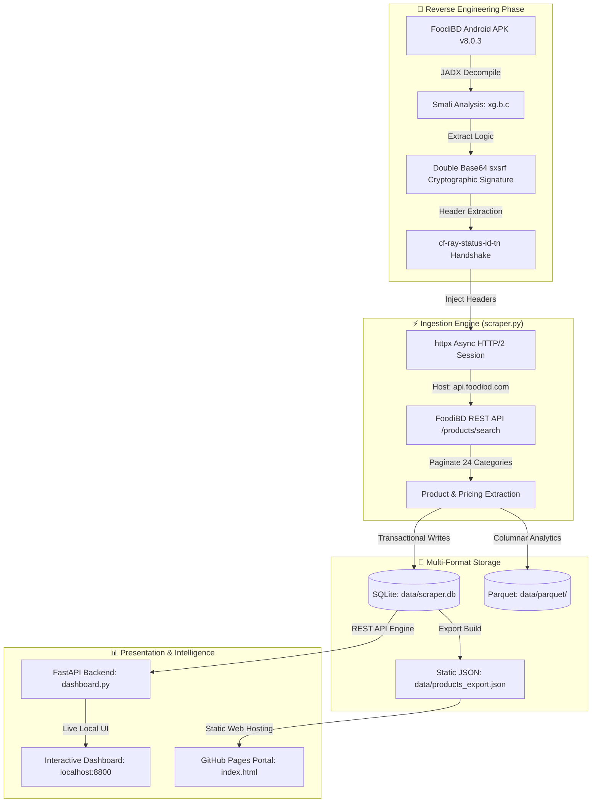

# 🍜 FooDIE-mart Analytics

> **Full-Spectrum Reverse-Engineered API Scraper, Cryptographic Handshake Engine, Multi-Format Data Pipeline & Interactive Analytics Suite for FoodiBD Mart.**

[](https://github.com/ranehal/FooDIE-mart-Analytics)
[](https://github.com/ranehal/FooDIE-mart-Analytics)
[](https://github.com/ranehal/FooDIE-mart-Analytics)
[](https://ranehal.github.io/FooDIE-mart-Analytics/)
[](#license)

---

## 📌 Executive Summary

**FooDIE-mart Analytics** is an end-to-end data engineering and analytics solution designed to reverse-engineer, scrape, store, and analyze product pricing data from **FoodiBD Mart** (Shop #11617 - Banasree, Dhaka). 

By decompiling the official Android APK (**v8.0.3**) via JADX, this project unlocked the proprietary dynamic cryptographic authentication header (`sxsrf`), bypassed Cloudflare security protections, and constructed an asynchronous HTTP/2 ingestion engine capable of tracking **5,159+ products** across **24 categories** with historical price change monitoring.

The repository includes a **FastAPI backend**, an **interactive web dashboard** (with Chart.js analytics and deal intelligence engine), and a **zero-dependency GitHub Pages web portal** for instant static browsing.

---

## 🚀 Key Features

- **🔐 Cryptographic Header Reverse-Engineering**: Implements the double-Base64 signature transformation (`Base64(Base64(token))`) identified in APK class `xg.b.c()`, dynamically refreshing tokens via `cf-ray-status-id-tn` response headers to bypass HTTP 401 blocks.
- **⚡ Asynchronous HTTP/2 Pipeline**: Powered by `httpx` and `asyncio` with concurrent request management, automatic pagination across all categories, exponential backoff, and stateful session resumes.
- **💾 Dual OLTP/OLAP Storage**:
  - **SQLite Database (`data/scraper.db`)**: High-performance transactional store with indexes on `product_id`, `category_id`, and `scraped_at`.
  - **Apache Parquet (`data/parquet/`)**: Columnar storage engineered for low-latency analytical queries and historical trend analysis.
- **🎯 Deal Intelligence Engine**: Automatically classifies items into **Great Deal**, **Good Buy**, **Wait**, and **All-Time Low (ATL)** by calculating rolling 30-day price standard deviations and historical averages.
- **📊 Modern Web Dashboard**: Built with FastAPI & Chart.js, featuring category breakdown charts, price distribution histograms, interactive search/filter toolbar, price comparison cart, and live debug console.
- **🌐 GitHub Pages Hostable**: Out-of-the-box support for static hosting via root `index.html` loading static dataset exports (`data/products_export.json`).

---

## 🏗 System Architecture



---

## 🔬 Deep Dive: Reverse Engineering FoodiBD Security

During initial API exploration, direct HTTP GET/POST requests to `imrs.foodibd.com` failed with `401 Unauthorized` responses. Inspecting network traffic and decompiling `Foodi_8.0.3.apk` revealed key security mechanisms:

### 1. The `sxsrf` Cryptographic Token
The application validates request integrity using a custom `sxsrf` header. Decompiling class `xg.b.c()` revealed the exact transformation pipeline:

$$\text{sxsrf} = \text{Base64}\left(\text{Base64}\left(\text{Header}_{\text{cf-ray-status-id-tn}}\right)\right)$$

### 2. Automatic SXSRF Bootstrap & Rotation
When a request yields an HTTP 401 response, the server embeds a fresh token payload inside the `cf-ray-status-id-tn` response header. The scraper extracts this raw header value, applies the double-Base64 transformation, and transparently retries the request.

```python
def double_base64_encode(value: str) -> str:
    """Matches the APK's internal xg.b.c() transformation algorithm."""
    step1 = base64.b64encode(value.encode("utf-8")).decode("utf-8")
    return base64.b64encode(step1.encode("utf-8")).decode("utf-8")

def extract_cf_ray_from_response(resp: httpx.Response) -> Optional[str]:
    """Extracts cf-ray-status-id-tn header and returns double-base64 sxsrf."""
    cf_raw = resp.headers.get("cf-ray-status-id-tn", "")
    if cf_raw:
        return double_base64_encode(cf_raw)
    return None
```

### 3. Cloudflare Host Routing Workaround
The backend infrastructure routes traffic via Cloudflare. The endpoint IP maps to `imrs.foodibd.com`, but Cloudflare rules and Spring Boot controllers strictly validate the `Host` header. Setting `"Host": "api.foodibd.com"` in headers resolved routing mismatches.

---

## 💾 Database Schema

### `products` Table
Stores current state and metadata for all scraped items.

| Column | Type | Description |
| :--- | :--- | :--- |
| `product_id` | `INTEGER PRIMARY KEY` | Unique product identifier |
| `name` | `TEXT` | Full product name |
| `sku` | `TEXT` | SKU code |
| `category_id` | `INTEGER` | Category ID |
| `category_name` | `TEXT` | Category name |
| `uom` | `TEXT` | Unit of measure (e.g., 500g, 1L) |
| `base_price` | `REAL` | Original retail price (BDT) |
| `discount` | `REAL` | Discount amount or percentage |
| `discounted_price` | `REAL` | Final consumer price (BDT) |
| `has_stock` | `INTEGER` | Availability flag (1 = in stock, 0 = out) |
| `image_path` | `TEXT` | Relative CDN image path |
| `last_updated` | `TEXT` | ISO 8601 timestamp of last scrape |

### `price_history` Table
Tracks price snapshots over time to enable historical analysis.

| Column | Type | Description |
| :--- | :--- | :--- |
| `id` | `INTEGER PRIMARY KEY` | Auto-incrementing log ID |
| `product_id` | `INTEGER` | Foreign key referencing `products` |
| `base_price` | `REAL` | Base price at snapshot time |
| `discounted_price` | `REAL` | Discounted price at snapshot time |
| `scraped_at` | `TEXT` | ISO 8601 timestamp |

---

## 💡 Deal Intelligence Classification Algorithm

The dashboard evaluates product prices against historical stats to assign real-time deal labels:

- 🌟 **Great Deal**: Discount $\ge 20\%$ **OR** current price is $\ge 15\%$ below its 30-day rolling mean.
- 👍 **Good Buy**: Discount $\ge 10\%$ **OR** current price is below its historical average.
- 📉 **All-Time Low (ATL)**: Current price matches the lowest price ever recorded for this product.
- ⏳ **Wait**: Current price is higher than the historical average.

---

## 📁 Repository Structure

```
FooDIE-mart-Analytics/
├── index.html                               # GitHub Pages interactive web portal & dashboard
├── scraper.py                               # Core async HTTP scraper engine & token logic
├── dashboard.py                             # FastAPI backend REST API server
├── config.yaml                              # Scraper & API parameters configuration
├── requirements.txt                         # Python dependencies
├── run.bat                                  # Windows quick launch script
├── parse_har.py                             # HAR log extraction utility
├── fix_tokens.py                            # Token verification utility
├── update_token.py                          # Session token updater script
├── Foodi_8.0.3.apk                          # Original FoodiBD Android APK (decompiled source)
├── imrs.foodibd.com_2026_07_24_03_32_42.har # Captured raw HAR network trace log
├── data/
│   ├── scraper.db                           # SQLite database (5,159 products, 20,288 history records)
│   ├── products_export.json                 # Static dataset export for GitHub Pages
│   └── resume_state.json                    # Scraper pagination resume checkpoint
└── static/
    ├── index.html                           # Local dashboard HTML UI
    ├── app.js                               # Dashboard JavaScript & Chart.js logic
    └── styles.css                           # UI CSS stylesheet
```

---

## ⚙️ Quick Start & Installation

### Prerequisites
- **Python 3.10+**
- `pip` package manager

### 1. Clone & Install Dependencies
```bash
git clone https://github.com/ranehal/FooDIE-mart-Analytics.git
cd FooDIE-mart-Analytics
pip install -r requirements.txt
```

### 2. Run Scraper Engine
To execute a scrape run and update `data/scraper.db`:
```bash
python scraper.py
```

### 3. Launch Local Web Dashboard
To start the FastAPI interactive web dashboard:
```bash
python dashboard.py
```
Open your browser at **`http://localhost:8800`**.

### 4. View GitHub Pages Hosted Version
Visit the live hosted static web portal at:  
👉 **[https://ranehal.github.io/FooDIE-mart-Analytics/](https://ranehal.github.io/FooDIE-mart-Analytics/)**

---

## 🛠 Configuration (`config.yaml`)

You can customize target store location, rate limits, and category lists inside `config.yaml`:

```yaml
shop:
  id: 11617
  name: "Foodimart - Banasree"
  latitude: 23.7518923
  longitude: 90.4340251

scraping:
  page_size: 20
  max_concurrent_requests: 3
  rate_limit_per_second: 2.0
  max_retries: 3

output:
  sqlite_path: "data/scraper.db"
  parquet_dir: "data/parquet"
```

---

## 👤 Author & Contribution History

Engineered and maintained by **ranehal**:

- **GitHub**: [@ranehal](https://github.com/ranehal)
- **Email**: [ran.ragibahnafnehal2@gmail.com](mailto:ran.ragibahnafnehal2@gmail.com)

Contributions spanned reverse engineering, Smali analysis, async scraper pipeline construction, SQLite/Parquet data modeling, FastAPI backend development, and web UI layout creation between **June 21, 2026** and **July 18, 2026**.

---

## 📄 License

This project is licensed under the **MIT License**. See the `LICENSE` file for details.
