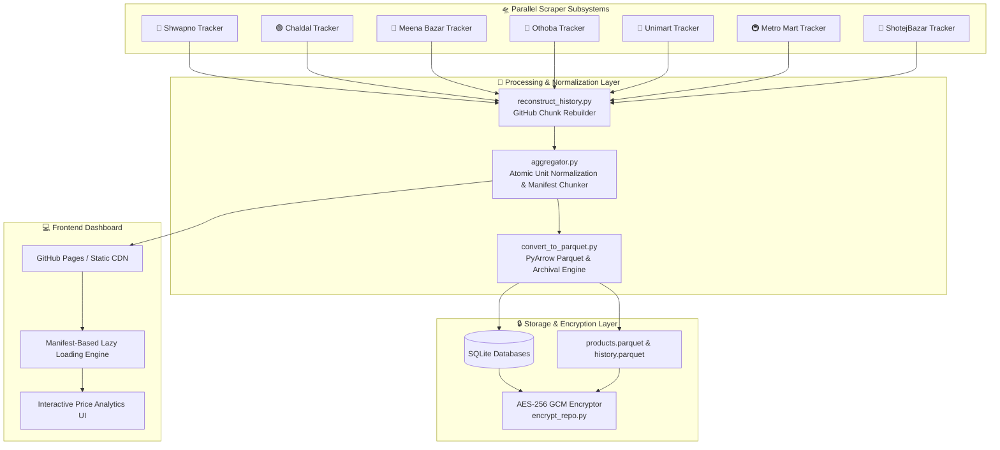

# 🛒 GroceryGOD // Unified Grocery Market Intelligence Engine


**GroceryGOD** is an enterprise-grade price tracking, historical market trend analysis, and unit price normalization engine for Bangladesh's leading online grocery chains. It continuously ingests, cleanses, standardizes, and indexes catalog data from **Shwapno**, **Chaldal**, **Meena Bazar**, **Othoba**, **Metro Mart**, **Unimart**, and **ShotejBazar**.

---

## 🏗 System Architecture



---

## ⚡ Core Technical Features

### 1. 🧮 Intelligent Unit Normalization & Price Standardization
Consumer products vary widely in packaging sizes (e.g. `250g`, `1.5L`, `40gm x 20pcs`, `1 hali`). GroceryGOD extracts packaging metrics using automated regular expressions to convert raw retail prices into standardized per-unit metrics ($\text{BDT}/kg$ or $\text{BDT}/L$):

$$\text{Standardized Price} = \frac{\text{Retail Price}}{\text{Parsed Unit Quantity}} \times \text{Multiplier}$$

- **Weight:** Normalized to **$\text{BDT}/kg$** (grams, mg, kg).
- **Volume:** Normalized to **$\text{BDT}/Liter$** (ml, ltr, liters).
- **Count:** Normalized to **$\text{BDT}/Piece$** (pcs, pack, hali, dozen).

### 2. 📦 Atomic Chunking & Synchronous Lazy Loading
To host multi-gigabyte historical catalog data on static CDNs without exceeding file size limits (`<50MB`), `aggregator.py` dynamically splits large JSON arrays into structured, atomic JS chunks (`*_data_part*.js`) backed by lightweight metadata manifests (`*_manifest.js`).

- **Initial Boot Payload:** Loads primary store data (`Shwapno`) on initial render for sub-second page loads.
- **On-Demand Fetching:** Asynchronously loads secondary market chunks only when requested via user interaction.

### 3. 📊 Dual Storage Pipeline (Parquet & JSON)
- **Apache Parquet (`pyarrow`):** Columnar compression for multi-year historical price trends ($7.5\text{M}+$ rows reduced to $<3\text{MB}$).
- **Free vs. Premium Tiers:** Produces trimmed public snapshots (`products_free.parquet`) while encrypting full historical archives (`history_archive.parquet.enc`).

### 4. 🔐 Enterprise Security & AES-256 GCM Encryption
All raw SQLite databases, proprietary scraper source scripts, and full historical archives are secured using **AES-256 GCM** encryption derived via **PBKDF2 SHA-256 (250,000 iterations)**.
- Public static JSON chunks remain unencrypted for static UI rendering.
- `encrypt_repo.py` and `decrypt_repo.py` enforce transparent pre-run decryption and post-run encryption in CI environments.

---

## 📊 Market Coverage & Specs

| Store | Scraper Engine | Items Indexed | Data Chunks | Strategy |
| :--- | :--- | :--- | :--- | :--- |
| 🛒 **Shwapno** | Requests / JSON API | ~8,000+ | 2 Chunks | Dynamic Promotion Pins & Tab Traversal |
| 🟢 **Chaldal** | Static / React State Hydration | ~4,400+ | 1 Chunk | Direct State Extraction & Hierarchy Mapping |
| 🏪 **Meena Bazar** | Playwright Headless + SQLite | ~14,000+ | 6 Chunks | Delivery Area Modal Bypassing & Infinite Scroll |
| 🔵 **Othoba** | Async Playwright + Semaphore | ~80,000+ | 33 Chunks | High-Throughput Multi-Sector Concurrency (8x) |
| 🚇 **Metro Mart** | Async HTTP + SQLite | ~900+ | 1 Chunk | Category Tree Mapping & Price Snapshots |
| 🦄 **Unimart** | REST API Ingestion | ~4,000+ | 1 Chunk | Direct Category API Scraping |
| 🍫 **ShotejBazar** | Deep HTML Page Parser | ~600+ | 1 Chunk | Multi-Pack Regex Parsing (`40g x 20pcs`) |

---

## 📂 Repository Structure

```
GroceryGOD/
├── 📄 aggregator.py           # Core aggregation & unit normalization engine
├── 📄 convert_to_parquet.py   # Apache Parquet conversion & tiering script
├── 📄 decrypt_repo.py         # AES-256 GCM repo decrypter
├── 📄 encrypt_repo.py         # AES-256 GCM repo encrypter
├── 📄 reconstruct_history.py  # Chunk rebuilder for continuous pipeline sync
├── 📄 patch_notebook.py       # Automated notebook runtime patcher
├── 🌐 index.html              # Modern web dashboard HTML
├── 🎨 style.css               # Dynamic dark/light UI design system
├── 📜 script.js               # Client-side filtering & lazy-loading engine
├── 📁 swapnoTRACKER/          # Shwapno scraper subsystem
├── 📁 PRICETRACKER/           # Chaldal scraper subsystem
├── 📁 MEENAtracker/           # Meena Bazar scraper subsystem
├── 📁 othobaTRACKER/          # Othoba scraper subsystem
├── 📁 metroTRACKER/           # Metro Mart scraper subsystem
├── 📁 unimartTRACKER/         # Unimart scraper subsystem
├── 📁 ShotejTRACKER/          # ShotejBazar scraper subsystem
└── 📁 premium/                # Encrypted historical archives
```

---

## 🛠 Local Setup & Running Scrapers

### Prerequisites
- **Python 3.10+**
- **Node.js 18+** (for Playwright dependencies)

### Installation

```bash
# Clone the repository
git clone https://github.com/ranx-x/GroceryGOD.git
cd GroceryGOD

# Install Python dependencies
pip install -r requirements.txt
playwright install chromium --with-deps
```

### Environment Configuration

Set the master decryption passphrase prior to execution:

```bash
# On Linux/macOS
export GOD_PREMIUM_KEY="your_encryption_passphrase"

# On Windows (PowerShell)
$env:GOD_PREMIUM_KEY="your_encryption_passphrase"
```

### Running Decryption & Pipeline

```bash
# Decrypt repository components
python decrypt_repo.py

# Execute data aggregator
python aggregator.py

# Generate Parquet analytics datasets
python convert_to_parquet.py

# Re-encrypt before deployment
python encrypt_repo.py
```

---

## 🤖 Continuous CI/CD & Automated Orchestration

The system includes an automated continuous execution engine (`gitgod.ipynb` executed via Kaggle / headless container environments) featuring:
- **Kaggle API Self-Restart:** Automatically syncs live source code and triggers kernel re-execution prior to container timeouts.
- **Telegram Bot Webhooks:** Sends real-time execution logs, IP updates, and failure alerts to configured Telegram channels.
- **Parallel Scraper Execution:** Uses `concurrent.futures.ThreadPoolExecutor` with per-scraper timeout safety limits.

---

## 🛡 License & Disclaimer

Copyright © 2026 **ranx-x**. All Rights Reserved.  
Data aggregated by GroceryGOD is collected strictly from publicly accessible online storefronts for market analytics and price comparison research. All brand names, logos, and trademarks belong to their respective owners.
